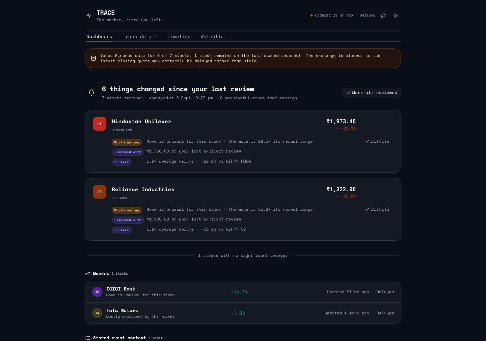
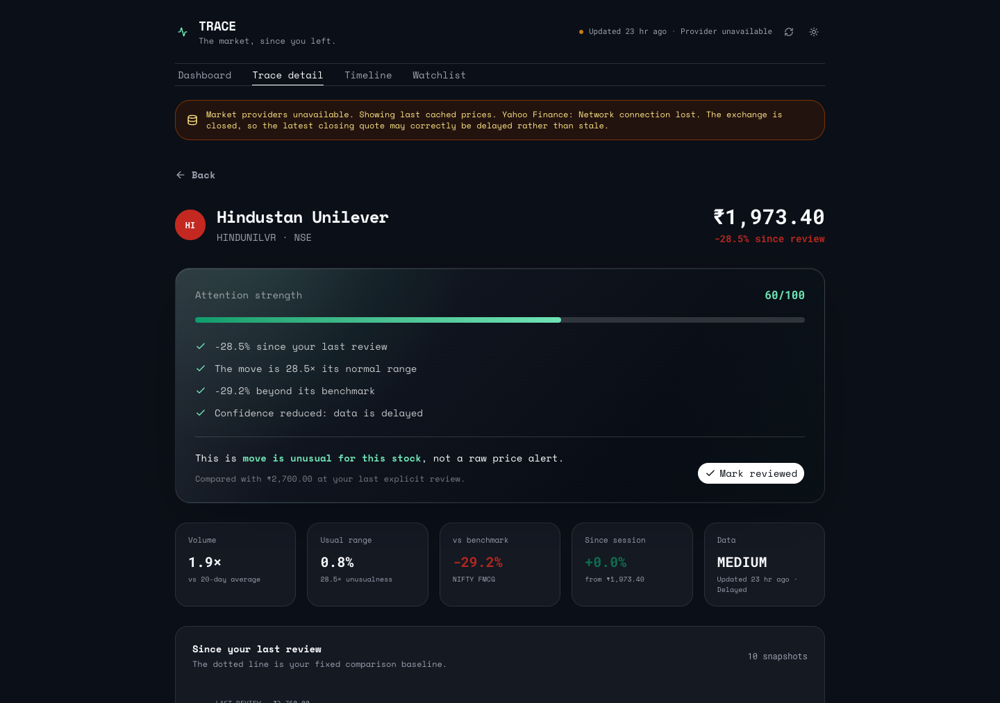
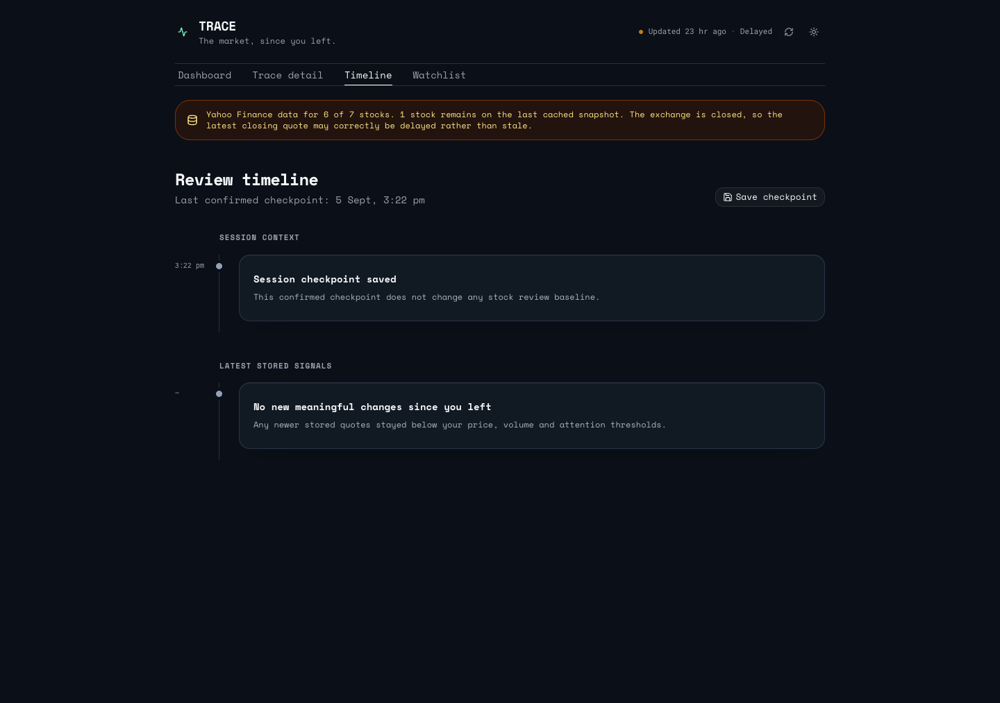
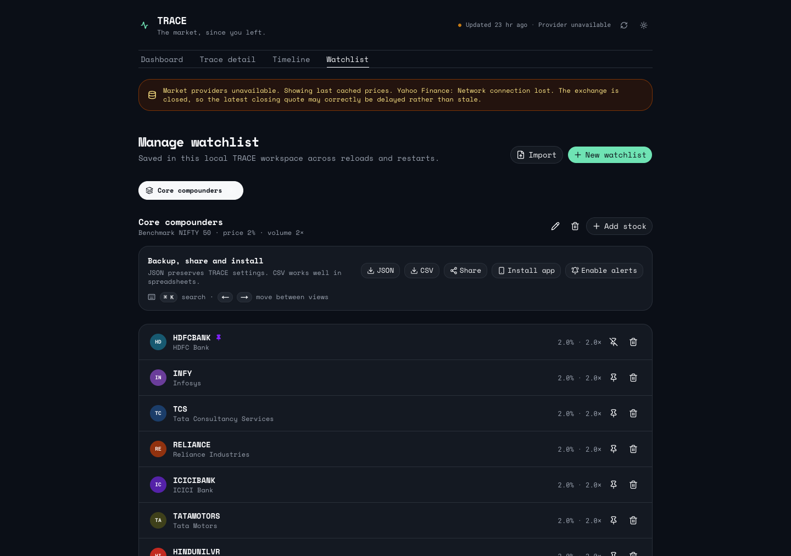

# TRACE — See what changed

A market watchlist that remembers what you last reviewed and surfaces the changes that deserve attention.

## 100-word product pitch

> TRACE is a smart market watchlist built around one question: what changed since I last checked, and does it actually matter? Instead of ranking stocks by raw price movement, TRACE stores explicit review baselines and compares them with the latest available market state. It evaluates price unusualness, volume anomalies, benchmark-relative movement, events, personal thresholds, and data quality to produce a transparent Attention Score with a plain-language reason. Quiet changes stay quiet. Delayed, stale, unavailable, and conflicting data are surfaced rather than hidden. A deterministic simulator makes the complete return-later workflow reproducible, while the underlying comparison and scoring logic remains real.

## Screenshots

| Attention-ranked dashboard                                                                   | Explainable stock detail                                                                                 |
| -------------------------------------------------------------------------------------------- | -------------------------------------------------------------------------------------------------------- |
|  |  |

| Confirmed checkpoint timeline                                                        | Watchlist management                                                                                                         |
| ------------------------------------------------------------------------------------ | ---------------------------------------------------------------------------------------------------------------------------- |
|  |  |

## The problem

Most watchlists are optimized for the present moment: current price, percentage change, charts, and alerts. When someone returns after several hours or days, the useful question is different:

> What meaningfully changed since I last checked, and what actually deserves my attention?

A 3% move may be unusual for one stock and ordinary for another. A large move may simply follow the entire sector, while a smaller stock-specific divergence supported by unusual volume may matter more. Sorting by raw percentage movement cannot express that distinction.

TRACE compares the current state with the moment the user last reviewed each stock. It then considers magnitude, normal behaviour, market context, personal sensitivity, and the trustworthiness of the underlying quote.

**TRACE ranks changes by how much attention they deserve, not stocks by how much they moved.**

## The core idea

```text
Traditional watchlist

Stock → Current price → Daily percentage change


TRACE

Stock
  ↓
Last explicitly reviewed state
  ↓
Latest available market state
  ↓
What changed?
  ↓
Is the change unusual for this stock?
  ↓
How does the move compare with its benchmark?
  ↓
Can the data be trusted?
  ↓
Attention Score + plain-language reason
```

The review baseline is persistent. Refreshing the page, reopening TRACE, polling for new market data, or receiving a new snapshot does not move it. The baseline changes only when the user explicitly selects **Mark reviewed**, **Dismiss**, or **Mark all reviewed**.

## Return-later model

TRACE keeps two concepts separate:

- A **review baseline** records the exact snapshot the user has acknowledged for an individual stock.
- A **confirmed session checkpoint** maps every tracked stock to the exact latest stored snapshot at the moment the checkpoint is accepted by the server.

```text
User reviews HDFCBANK
        ↓
Current snapshot becomes its review baseline
        ↓
User saves a checkpoint, or the demo confirms one server-side
        ↓
Market snapshots continue to arrive
        ↓
User returns
        ↓
Latest snapshot is compared with both saved references
        ↓
Only new meaningful changes are promoted
```

Review baselines answer “what changed since I acknowledged this stock?” Confirmed session checkpoints answer “what changed after that saved moment?” Neither is overwritten by a market refresh.

TRACE also makes a best-effort automatic checkpoint request when the page becomes hidden or is left. It uses `sendBeacon` when available, falls back to a keepalive request, and reuses one client-generated checkpoint ID so duplicate browser events are idempotent. Browser shutdown cannot guarantee that any final network request is delivered, so the UI does not describe that path as guaranteed. **Save checkpoint** in the Timeline and the server-side `/demo` workflow are the explicit, confirmed paths.

## Meaningful change and the Attention Score

For each watchlist item, TRACE calculates:

```text
return_since_review = (current_price - review_price) / review_price
relative_move = return_since_review - benchmark_return
volume_ratio = current_volume / average_20_day_volume
volatility_score = abs(return_since_review) / max(normal_daily_volatility, 0.01)
```

The score uses bounded, inspectable components:

| Signal                                | Maximum contribution |
| ------------------------------------- | -------------------: |
| Price unusualness                     |                   30 |
| Volume anomaly                        |                   25 |
| Benchmark-relative movement           |                   20 |
| Corporate event                       |                   13 |
| 52-week high or low crossing          |                   12 |
| Unexplained price and volume movement |                    8 |
| Personal threshold match              |                    5 |

The combined result is clamped to 0–100 and multiplied by a data-quality factor: live `1.00`, delayed `0.85`, conflicted `0.60`, stale `0.55`, or unavailable `0.30`.

The column maxima total 113 by design, but all seven cannot be awarded together: the 13-point corporate-event component and the 8-point unexplained-movement component are mutually exclusive. The highest simultaneously awardable raw score is therefore 105. The final clamp provides five points of corroboration headroom while keeping the interface on a stable 0–100 scale. The score represents attention priority, not probability.

| Score  | Meaning         |
| ------ | --------------- |
| 75–100 | Needs attention |
| 45–74  | Worth noting    |
| 0–44   | Quiet           |

Every highlighted stock explains what changed, the review or session price used for comparison, and which facts made the move meaningful. The engine is deliberately deterministic rather than ML-based so every ranking can be reproduced, inspected, and tested.

## Data confidence and freshness

Data reliability is part of the answer, not hidden metadata. Each stored snapshot contains the provider, provider timestamp, receive time, freshness state, confidence, and an idempotent ingestion key.

TRACE supports five quality states:

- **Live:** recent enough during an open market session.
- **Delayed:** usable, but not current enough to call live.
- **Stale:** older than the accepted window.
- **Conflicted:** two represented provider values disagree beyond tolerance.
- **Unavailable:** no usable current provider observation exists.

Freshness is recalculated whenever the dashboard is read, so a historical `LIVE` label cannot survive indefinitely. Quote ages are displayed relative to the response time. NSE and BSE weekday trading hours, 09:15–15:30 in `Asia/Kolkata`, are considered so a valid closing quote is not incorrectly called stale overnight. The prototype does not include a complete exchange-holiday calendar.

When every provider fails, TRACE retains the last stored snapshot and discloses the outage. Cached values are never silently represented as current.

The `/demo` route includes a deterministic conflict-handling scenario. It stores two simulated provider values, displays their percentage difference, compares that difference with the 0.8% tolerance, and reduces confidence instead of averaging them. Continuous real multi-provider reconciliation is not implemented.

## Reproducible demo

1. Install and start TRACE using the local instructions below.
2. Open `http://localhost:3000/demo`.
3. Choose **Reset demo data** if you want the original state.
4. Choose **Run the complete return-later story**.
5. Return to `http://localhost:3000` and open the Timeline or HDFCBANK detail.

The complete scenario explicitly reviews the current stocks, saves an exact per-stock checkpoint, advances all seven tracked instruments, and makes only HDFCBANK cross a meaningful threshold. Ordinary new snapshots remain below the configured attention threshold.

```text
Review current state
        ↓
Save exact checkpoint mapping
        ↓
Advance simulated market
        ↓
HDFCBANK changes meaningfully
        ↓
Other changes remain insignificant
        ↓
TRACE prioritizes HDFCBANK on return
```

A short demonstration cannot wait for several real trading sessions to produce a specific market condition. The simulator therefore controls the inputs while the same comparison, confidence, scoring, and ranking logic evaluates them.

**The inputs are simulated; the intelligence is not.**

## Architecture

```text
┌────────────────────────────────┐
│            TRACE UI            │
│ Dashboard · Detail · Timeline  │
└───────────────┬────────────────┘
                │
                ▼
        ┌───────────────┐
        │ Service / API │
        └───────┬───────┘
                │
       ┌────────┴─────────┐
       ▼                  ▼
Market providers     Local D1 / SQLite
       │                  │
       └────────┬─────────┘
                ▼
      Append-only market snapshots
                │
       ┌────────┴─────────┐
       ▼                  ▼
Current snapshot     Review/checkpoint references
       │                  │
       └────────┬─────────┘
                ▼
       Deterministic change engine
                │
                ▼
       Attention Score + explanation
```

Market observations belong to instruments rather than individual users. `market_snapshots` is append-only. Watchlist items reference the last reviewed snapshot, while `session_checkpoint_snapshots` maps each session checkpoint to one exact snapshot per tracked instrument. Review actions also create auditable `review_events`.

The schema is managed through committed Drizzle migrations. Uniqueness constraints prevent duplicate instruments, duplicate watchlist membership, duplicate ingestion keys, and duplicate instrument mappings within one checkpoint. Relevant watchlist and instrument/session access paths are indexed.

## Market data

The attention engine is isolated from a specific vendor. The active local chain is:

```text
Twelve Data when configured
        ↓ fallback
Loopback yfinance service using Yahoo Finance data
        ↓ fallback
Latest stored or seeded snapshot
```

The yfinance adapter supplies price, volume, 20-day average volume, estimated daily volatility, 52-week range, and the recent price path. Yahoo information can be delayed, so TRACE uses the provider timestamp and does not call it real-time data.

The browser requests a refresh when the tab becomes visible and every five minutes while it stays open. New observations append shared snapshots; they never update review baselines. Provider credentials remain server-side in the ignored `.dev.vars` file.

## Failure handling

| Situation                  | TRACE behaviour                                                                      |
| -------------------------- | ------------------------------------------------------------------------------------ |
| Empty watchlist            | Purpose-built empty state with an add-stock action                                   |
| Duplicate stock            | Prevented by service validation and a database uniqueness constraint                 |
| Unknown imported symbol    | Import rejected with the unknown symbols; no partial list is created                 |
| Provider unavailable       | Last stored value retained and the failure disclosed                                 |
| Stale quote                | Timestamp and stale status shown; score confidence reduced                           |
| Conflicting quote          | Both simulated values shown; score confidence reduced                                |
| Missing review baseline    | No comparison is invented; the user is prompted to review once                       |
| Page or market refresh     | Review baselines remain unchanged; previously confirmed checkpoints remain immutable |
| Database failure           | Explicit error screen with the actual error and a retry action                       |
| Insignificant new snapshot | Not promoted as a meaningful Timeline event                                          |

## Technology

- **Interface:** Vinext, React 19, TypeScript, Tailwind CSS, Base UI
- **Backend:** Next-compatible server routes and a focused service layer
- **Persistence:** Cloudflare D1-compatible SQLite through local Miniflare; Drizzle schema and migrations
- **Market data:** Twelve Data when configured, yfinance/Yahoo fallback, deterministic demo provider
- **Testing and quality:** Node test runner, Oxlint, Oxfmt, production compilation

## Run locally

Prerequisites: Node.js 22.13 or newer and Python 3.

```bash
git clone https://github.com/srvnnithya/Trace.git
cd Trace
npm install

cp .dev.vars.example .dev.vars
python3 -m venv .venv
.venv/bin/pip install -r requirements-yfinance.txt

npm run dev
```

Open `http://localhost:3000`. The development command applies pending committed D1 migrations, starts TRACE, and starts the loopback-only yfinance service. Miniflare state remains project-local. `TWELVE_DATA_API_KEY` is optional; without it, TRACE tries yfinance and then stored snapshots.

Never commit `.dev.vars`. Only `.dev.vars.example`, containing placeholders, belongs in Git.

Validation commands:

```bash
npm test
npm run lint
npm run build
```

The current repository has **23 passing tests**, a passing lint run, and a passing production build.

## What is tested

The suite focuses on product invariants rather than only happy-path endpoints:

- attention score bounds and deterministic output;
- unusual versus quiet ranking;
- corporate-event context and 52-week level crossings;
- benchmark-relative movement and personal thresholds;
- stale and conflicted confidence penalties;
- invalid timestamps and stored delayed-state preservation;
- provider parsing, conflict tolerance, and market-hours freshness;
- missing-baseline behaviour;
- watchlist import normalization, duplicate removal, and the 100-item batch limit;
- exact checkpoint-to-instrument-to-snapshot mapping;
- idempotent checkpoint replay preserving one mapping per instrument;
- refresh snapshots leaving review baselines and confirmed checkpoint mappings unchanged;
- explicit review changing only the review baseline;
- duplicate checkpoint mappings being rejected;
- checkpoint mapping cleanup through database cascades.

## Production scaling approach

The working prototype intentionally targets a reproducible local, single-user environment. Its append-only instrument snapshots and user-specific references already separate shared market state from attention state. A recent-observation guard also avoids unnecessary refreshes within five minutes.

The next production evolution would move provider fetching out of page requests. A scheduled instrument-level ingester with distributed locking would fetch each symbol once, store shared snapshots, and cache the latest state. Authenticated users would store only watchlist membership, preferences, and review references against that shared history. Background batching would precompute assessments, while cursor pagination or row virtualization would support large watchlists.

That is a production scaling approach, not infrastructure claimed by this prototype.

## Trade-offs and limitations

Current limitations:

- Single-user, local-first state; there is no cross-device account synchronization.
- Market information may be delayed depending on the active provider.
- Stored event examples belong to deterministic demo data, not a production news feed.
- Conflict handling is demonstrated deterministically, not through continuous real multi-provider reconciliation.
- Regular NSE/BSE hours are considered, but a complete exchange-holiday calendar is not implemented.
- Background ingestion, authenticated hosted persistence, batching, and pagination are architectural next steps.

Deliberate decisions:

- **Deterministic scoring over ML:** rankings remain explainable, reproducible, and testable.
- **Explicit review over automatic baseline movement:** opening or refreshing TRACE must not erase unseen changes.
- **Modular monolith over microservices:** appropriate for the current product and demonstration scale.
- **Shared instrument history as the scaling direction:** the same market observation should not be fetched separately for every user.
